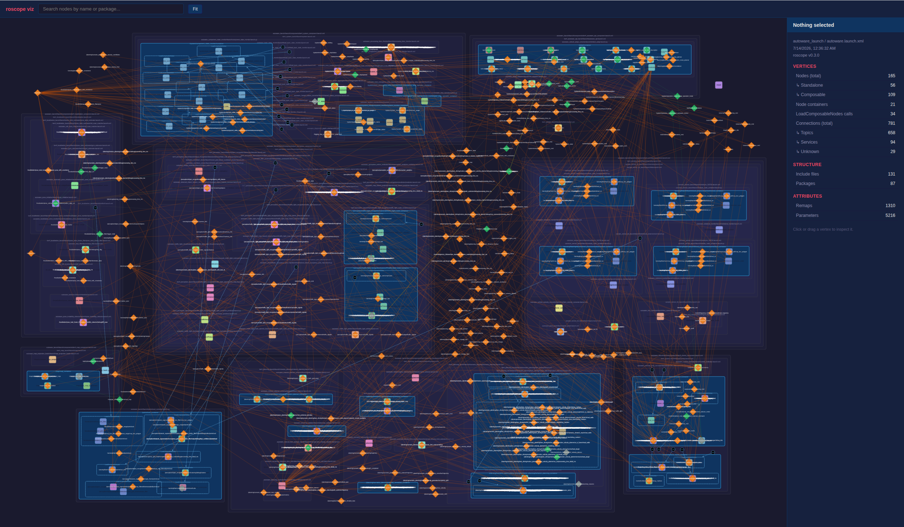

# roscope

**ROS 2 launch system inspector** — evaluate your launch topology
without a ROS 2 runtime.



roscope evaluates launch descriptions following ROS 2 semantics — resolving
substitutions, evaluating conditionals, and executing Python
`generate_launch_description()` callables — without a running ROS environment
or a built workspace. From a single launch file it derives the launch
topology: every node, parameter, remap, topic connection, package dependency,
and include boundary that would be active at runtime. In practice this is the
right level of detail — nodes, parameters, and remaps are what vary between
configurations, and changes there are what you actually need to detect and
audit. Targeted builds of exactly those packages are also supported.

## The problem

A typical ROS 2 workspace like [Autoware](https://github.com/autowarefoundation/autoware)
contains **400+ packages** across dozens of repositories. Before you can answer
"what nodes does this launch file actually start?", the standard workflow demands:

```
# Traditional ROS 2 workflow
vcs import src < autoware.repos      # clone ~30 repos
rosdep install --from-paths src      # install ALL system deps
colcon build                         # build ALL ~400 packages (1+ hours)
ros2 launch autoware_launch ...      # finally launch
```

This is slow, wasteful, and makes it hard to audit or iterate on a subset of
the system. The topology — which nodes run, which topics they use, which
parameters are set — is locked away behind a full build.

## The solution

roscope treats the **launch file as the system description language of ROS 2** — not just a convenience script to collectively start nodes,
but a sufficient, inspectable specification of the system topology.

It partially evaluates the description following the same semantics as `ros2 launch`, but without a running ROS environment. You can use it directly on a workspace you already have:

```
# roscope workflow — no build required
vcs import src < autoware.repos          # clone repos (as usual)
roscope resolve -d autoware_launch autoware.launch.xml \
  sensor_model:=sample_sensor_kit \
  vehicle_model:=sample_vehicle \
  map_path:=/path/to/map \
  --preview \
  --visualize                            # interactive graph in your browser
```

The resolved output is a **flattened, fully-resolved XML** with all includes
inlined, conditionals evaluated, and variables substituted. The visualizer turns
that into an interactive connectivity graph — nodes, containers, topics, remaps,
and include boundaries — all explorable before a single package is built.

Targeted builds are also supported: from the same launch evaluation, roscope
knows exactly which packages are needed and can fetch and build only those.

## Key features

- **Runtime topology without runtime** — derive the sufficient launch graph and inspect nodes, parameters, remaps, and topics without a build or running ROS environment.
- **Python launch support** — executes `generate_launch_description()` with
  shimmed `launch`/`launch_ros` imports; no installed ROS 2 Python packages needed
- **OpaqueFunction handling** — executes arbitrary Python callables,
  transparently fetching packages as they are accessed
- **Interactive visualizer** — compound graph view of the full launch structure,
  with selection, detail panel, and topic tracking
- **rosdep integration** — automatically installs system dependencies for the
  packages being built
- **Targeted builds** — the packages required by your launch target are derived
  from the evaluation; only those are fetched and built
- **Lockfile pinning** — reproducible analysis and builds via commit-SHA-pinned lockfiles
- **On-demand sparse checkout** — combined with lockfile, packages are sparse-cloned only when
  referenced by the launch file, via
  [git sparse-checkout](https://git-scm.com/docs/git-sparse-checkout)

> **Current scope:** roscope covers launch evaluation for Autoware without a ROS runtime today.
> Targeted builds are supported with `colcon build` as the backend.
> roscope is designed as a **build-time companion** to `ros2 launch`, not a replacement —
> the two tools operate at different phases and serve different purposes.
> Deeper integration options (e.g. launching directly from a resolved graph) are on the roadmap.

## Quick start

### Prerequisites

- **Python 3.10+** — used to evaluate Python launch files and `$(eval ...)` substitutions in XML
- **Git** — for sparse-checkout operations
- **ROS 2** — source your ROS 2 environment (`source /opt/ros/<distro>/setup.bash`)
- **pnpm** — required to build the web visualizer ([install](https://pnpm.io/installation))
- **rosdep** — required for `--rosdep` (part of `ros-dev-tools`, not the base ROS 2 runtime)
- **colcon** — required for `build` / `test` commands (part of `ros-dev-tools`)

### Install

```bash
pip install git+https://github.com/paulsohn/roscope.git
```

Or for development:

```bash
git clone https://github.com/paulsohn/roscope.git
cd roscope
pip install -e .
```

### Try the bundled Autoware example

An [Autoware workspace](https://github.com/autowarefoundation/autoware) example is included in [`example/autoware/`](example/autoware/).
You can run the resolver immediately once after you clone everything in `manifest.repos` (which is a mirror of the official `autoware.repos`).

```bash
cd example/autoware

# Source ROS 2 first
source /opt/ros/<distro>/setup.bash

# For the first time, to initialize the workspace
vcs import src < manifest.repos

# Preview-resolve: produces flattened XML without building
roscope resolve -d autoware_launch autoware.launch.xml \
  sensor_model:=sample_sensor_kit \
  vehicle_model:=sample_vehicle \
  map_path:=/path/to/map \
  --show-args \
  --rosdep \
  --preview \
  > resolved.launch.xml
```

The pre-generated output files are included for reference:
- [`example/autoware/resolved.launch.xml`](example/autoware/resolved.launch.xml)
- [`example/autoware/resolver.log`](example/autoware/resolver.log)

To build only the packages the launch file needs:

```bash
roscope build -d autoware_launch autoware.launch.xml \
  sensor_model:=sample_sensor_kit \
  vehicle_model:=sample_vehicle \
  map_path:=/path/to/map \
  --rosdep \
  --colcon-flagfile colcon-flags.txt
```

## Visualizer

`resolve` accepts a `--visualize` flag that opens an interactive
graph view of the resolved launch structure in your browser:

```bash
roscope resolve -d autoware_launch autoware.launch.xml \
  sensor_model:=sample_sensor_kit \
  vehicle_model:=sample_vehicle \
  map_path:=/path/to/map \
  --preview \
  --visualize
```

The visualizer shows the full node graph — groups (include boundaries),
containers, composable nodes, topics, and remaps — as a compound graph with
interactive selection and detail panel.

Use `--viz-id <name>` to label the snapshot. Snapshots are cached in
`~/.cache/roscope-viz/`.

### Use your own workspace

If you already have a workspace cloned with `vcs import` (or any other way),
pass `--dirty` / `-d` and roscope will scan your `src/` directory for packages:

```bash
vcs import src < your-project.repos    # clone repos as usual
roscope resolve -d <pkg> <launcher> [args...]   # inspect without building
roscope build -d <pkg> <launcher> [args...] --rosdep   # build only what's needed
```

See the [Getting Started guide](docs/getting-started.md) for a full walkthrough.

## Commands

| Command | Description |
|---|---|
| `index` | Parse `.repos` files and generate a lockfile |
| `update` | Re-resolve refs and update lockfile SHAs |
| `resolve` | Resolve and flatten a launch file to XML (no build) |
| `check` | Like `resolve` but exits non-zero on warnings/errors |
| `build` | Resolve, fetch dependencies, and run `colcon build` |
| `build-pkg` | Build package(s) by name with transitive dependency fetching |
| `test` | Like `build` but includes `test_depend` packages |
| `fetch` | Sparse-checkout specific packages from the lockfile |
| `clean` | Remove fetched packages |

Run `roscope <command> --help` for detailed usage of each command.

## Lockfile workflow

For reproducible analysis and targeted sparse-checkout (fetching only the
packages a launch file needs rather than cloning everything), roscope has a
lockfile-based workflow as default:

```bash
# 1. Generate a lockfile from a .repos manifest (one-time)
roscope index your-project.repos

# 2. Resolve — roscope sparse-clones only the needed packages on demand
roscope resolve <pkg> <launcher> [args...] --preview --visualize

# 3. Build only the resolved packages
roscope build <pkg> <launcher> [args...] --rosdep

# 4. For CI / reproducible runs, add --clean to reset repos to lockfile SHAs
roscope build <pkg> <launcher> [args...] --clean --rosdep
```

With a lockfile, roscope pins every repository to a specific commit SHA, so analyses and builds are fully reproducible across machines.
Packages are sparse-cloned on demand rather than importing the entire workspace up front, which you can apply full clone any time you want.

Commands that refer to source code support workspace state flags:

| Flag | Short | When to use |
|---|---|---|
| *(default)* | | Verifies HEAD matches lockfile SHA; errors on mismatch |
| `--clean` | `-c` | CI / reproducible runs — resets repos to lockfile SHAs |
| `--dirty` | `-d` | No lockfile required — scans `src/` for packages as-is |

In dirty mode roscope does not read a lockfile.  Instead it walks the source directory (default: `src/`) looking for `package.xml` files.  This supports workflows where `src/` is populated by `vcs import` without generating a lockfile first.

See [Core Concepts](docs/concepts.md) for more on lockfiles and sparse checkout.

## Documentation

| Document | Description |
|---|---|
| [Motivation](docs/motivation.md) | Why roscope exists and what problems it solves |
| [Core Concepts](docs/concepts.md) | Launch language semantics, resolution, lockfiles, sparse checkout, and more |
| [Getting Started](docs/getting-started.md) | Step-by-step tutorial for your own project |
| [Architecture](docs/architecture.md) | How the resolver, fetcher, and builder work internally |
| [Supported Environments](docs/supported-environments.md) | Platforms, ROS distros, and known limitations |
| [FAQ](docs/faq.md) | Common questions and answers |
| [Contributing](CONTRIBUTING.md) | Development setup and contribution guidelines |

## Who is this for?

- **ROS 2 developers** who want to understand what a launch file actually does —
  every node, parameter, remap, and include boundary — without a full build
- **System integrators** auditing a large workspace: roscope makes the full
  launch graph inspectable and the include chain explicit
- **CI/CD pipelines** that need to validate launch configurations or build and
  test only the packages a given launch file requires
- **Anyone** working with large multi-repository workspaces who wants faster
  iteration without waiting for a full workspace build

## License

Apache-2.0 — see [LICENSE](LICENSE).
