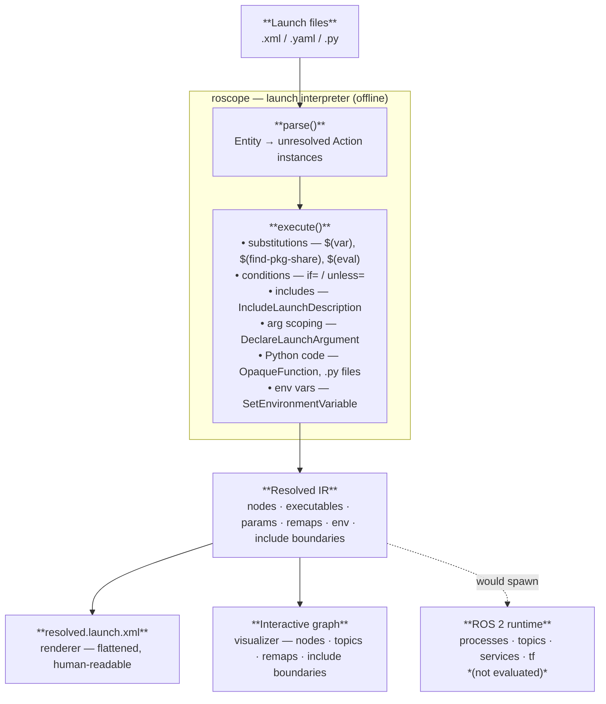

# Architecture

## Overview

roscope is a pure Python application whose core is a **launch file resolver**:
a partial evaluator that derives the launch topology of a ROS 2 system
from its launch description, without a running environment.  Targeted builds
and on-demand package fetching are built on top of the resolver.  The CLI is
built with Click; all modules are importable as a Python library.

```
┌───────────────────────────────────────────────────────┐
│  CLI (cli.py)                                         │
│  Click argument parsing → delegates to modules        │
├───────────────────────────────────────────────────────┤
│  Core Library (roscope)                               │
│  ├── indexer    — .repos → lockfile                   │
│  ├── fetcher    — git sparse-checkout on demand       │
│  ├── resolver   — launch file resolution              │
│  │   ├── shim modules for launch/launch_ros           │
│  │   ├── OpaqueFunction execution                     │
│  │   └── package path resolution                      │
│  ├── orchestrator — coordinates resolve + fetch loop  │
│  ├── renderer   — resolved IR → XML output            │
│  ├── visualizer — graph data + HTTP server             │
│  ├── builder    — colcon build orchestration          │
│  └── rosdep     — system dependency resolution        │
└───────────────────────────────────────────────────────┘
```

## Data flow

### 1. Index phase

```
.repos file(s)
    │
    ▼
[indexer]
    ├── git ls-remote → resolve versions to SHAs
    ├── git archive → fetch package.xml files (no full clone)
    └── parse package.xml → discover package names and paths
    │
    ▼
manifest.lock.repos (lockfile)
```

The indexer reads one or more `.repos` files, resolves each version reference
(tag, branch, or SHA) to a concrete commit SHA via `git ls-remote`, fetches
`package.xml` files via `git archive` (without cloning), and writes the
dual-indexed lockfile.

### 2. Resolve phase

roscope is a **launch interpreter running offline** — it evaluates the same
semantics as `ros2 launch` but stops before spawning processes.  It is a
partial evaluator, not a static analyzer: Python code runs, `OpaqueFunction`
bodies execute, and include chains are followed recursively.



The orchestrator wraps the resolver in a fetch-retry loop: when a package
has not been sparse-checked out yet, a `_PackageNotFetchedError` is raised,
the fetcher pulls the missing subtree, and the resolver retries (up to three
times).

### 3. Build phase

```
roscope build <pkg> <launcher>
    │
    ▼
[orchestrator]
    ├── resolve launch file (preview mode)
    ├── collect direct packages from launch graph
    │
    ▼
[dependency planner]
    ├── expand transitive build deps from package.xml
    ├── separate lockfile packages from system packages
    │
    ▼
[fetcher] — fetch any missing build dependencies
    │
    ▼
[rosdep] — install system packages (with --rosdep)
    ├── rosdep resolve → apt/pip package names
    ├── apt-get install
    └── pip install
    │
    ▼
[builder]
    └── colcon build --packages-select <minimal set>
```

## Key components

### Indexer (`indexer.py`)

Generates lockfiles from `.repos` manifests.  Uses `git ls-remote` for version
resolution and `git archive` to fetch `package.xml` files without full clones.
Parses `package.xml` to extract dependency information including REP-149
condition attributes for conditional dependencies.

### Fetcher (`fetcher.py`)

Manages git sparse-checkout.  The primary API is:
- **`fetch_packages()`** — full sparse-checkout of one or more package subtrees,
  including `package.xml` and all files
- **`is_package_fetched()`** — checks whether a package has been fetched
  (sentinel: `package.xml` exists on disk)

Sparse-checkout is additive: new paths are added without removing previously
checked-out files.

### Resolver (`resolver.py`)

A self-contained Python module that resolves both XML and Python launch files.
It:

1. Installs a `MetaPathFinder` that intercepts imports of `launch`, `launch_ros`,
   and `ament_index_python`
2. Replaces them with shim modules that record constructor arguments
3. Loads the target launch file via `importlib`
4. Calls `generate_launch_description()`
5. Walks the resulting `LaunchDescription` tree
6. Returns a `ParsedLaunchFile` dataclass describing all actions (nodes,
   includes, params, etc.)

The shims require no ROS 2 Python packages to be installed.  `OpaqueFunction`
bodies are executed directly by calling `fn(context)` with the resolver's
launch context.

### Orchestrator (`orchestrator.py`)

Coordinates the resolve-fetch loop.  When the resolver encounters a package
that hasn't been fetched yet, it signals via `_PackageNotFetchedError`.  The
orchestrator catches this, fetches the missing package, and retries (up to
3 times).

### Renderer (`renderer.py`)

Converts the resolved IR (`ResolvedNode` trees) into human-readable XML output.
Supports namespace flattening, argument display, parameter inlining, and
include-chain source comments.

### Visualizer (`visualizer/`)

Turns the resolved launch graph into an interactive browser-based view.
Key sub-modules:

- **`graph.py`** — converts the resolved action tree into a JSON graph
  (`GraphData`) containing nodes, edges, topics, groups, and metadata
  (including the roscope version).  Called at the end of `resolve` when
  `--visualize` is passed.
- **`server.py`** — serves the compiled React SPA and streams graph snapshots
  to connected browsers over HTTP.  Snapshots are cached in
  `~/.cache/roscope-viz/` so the browser can be opened after the resolve
  completes.
- **`schema.py`** — dataclasses that define the canonical graph schema shared
  between Python and the TypeScript frontend (via `generate_types.py`).

### Builder (`builder.py`)

Computes the transitive build-dependency closure and invokes `colcon build`.
Reads extra arguments from a flagfile.  Validates that flagfile tokens don't
conflict with roscope-managed arguments.

### Rosdep (`rosdep.py`)

Resolves rosdep keys to system package names via `rosdep resolve`, then installs
via `apt-get` or `pip` directly.  Caches the set of already-installed ROS
packages per-process to skip redundant resolution.

## Design decisions

### Why `rosdep resolve` instead of `rosdep install`?

`rosdep install` without `--from-paths` treats its arguments as ROS package
names (via `rospkg.expand_to_packages()`) and fails on pure system keys like
`asio`.  With `--from-paths`, it scans every `package.xml` and pulls in
unresolvable test-only dependencies.  `rosdep resolve` maps keys to system
packages cleanly without either problem.

### Why shim modules instead of real launch/launch_ros?

Installing `launch` and `launch_ros` would require a full ROS 2 Python
environment on the resolver host.  The shims let roscope work with just
Python 3 and no ROS 2 installation — the resolver is a standalone tool.

### Why pure Python?

ROS 2 is fundamentally a Python ecosystem.  A Rust+Python hybrid required
maintaining a subprocess boundary with JSON serialization — every new node
attribute needed changes in three places (Python shim, JSON serde structs, Rust
IR types).  Pure Python eliminates this boundary friction, simplifies
installation to `pip install roscope`, and lets the resolver return
`ParsedLaunchFile` dataclasses directly instead of serializing through JSON.
